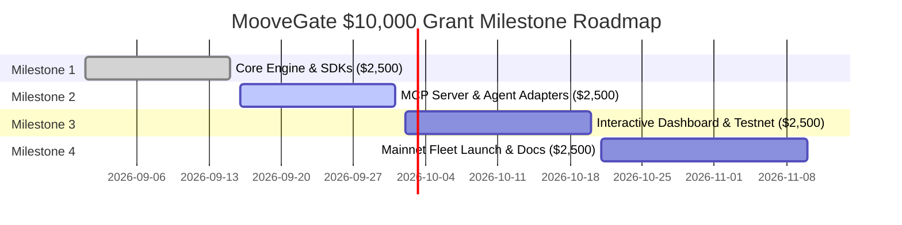

# Official Moove Developer Fund Grant Application ($10,000 USDC)

**Form Submission Reference:** [Moove Developer Program Official Application](https://forms.cloud.microsoft/r/fZ0Z7xsDuh)  
**Program URL:** [https://www.moove.xyz/blog/everything-you-need-to-know-about-moove-developer-program](https://www.moove.xyz/blog/everything-you-need-to-know-about-moove-developer-program)  

---

## 1. Project Overview

| Field | Submission Details |
| :--- | :--- |
| **Project Name** | **MooveGate (MooveSynapse)** |
| **Project Tagline** | *The Universal Autonomous Agent-to-Agent (A2A) Micro-Commerce Gateway & Model Context Protocol (MCP) Server for Moove Agentic Payments.* |
| **Category** | AI Agent Builders / Web3 Developer Tooling / Agentic Commerce |
| **Target Grant Request** | **$10,000 USDC** (Milestone-based, 4 tranches of $2,500) |
| **Payment Recipient** | Project Moove Handle (e.g., `@moovegate` / `@salman`) |
| **Repository** | Public GitHub Repository (with MIT Open Source License) |
| **Current Stage** | **Working Prototype & Architecture Ready (Phase 1 Code Shipped)** |

---

## 2. Executive Summary & The Problem

AI agents (LLMs, autonomous bots, multi-agent frameworks) are rapidly becoming the primary consumers and providers of digital services: generating code, running zero-knowledge audits, synthesizing research datasets, and executing on-chain rebalancing.

However, **AI agents currently have no native way to monetize their outputs or conduct trustless bilateral commerce**:
- Traditional payment gateways (Stripe, card networks) require human KYC, credit cards, and 2FA prompts that bots cannot complete.
- Traditional crypto escrows require heavyweight smart contract deployments on a single chain with high gas overhead.
- AI agents risk the **Fair-Exchange Dilemma**: if Agent A pays first, Agent B may defect; if Agent B provides the data first, Agent A will steal the compute.

### The Solution: MooveGate
**MooveGate** solves this problem by combining **Cryptographic Hash Commitments (SHA-256)** with **Moove Agentic Payments' cross-chain Receive Agent**.
1. **Zero Custody**: MooveGate never touches private keys. It relies entirely on Moove's multi-chain hosted payment links (`POST /v1/payment-link`) and settlement verification (`GET /v1/payment-link/{id}`).
2. **Model Context Protocol (MCP) Server**: Provides the first standardized MCP server for Moove, enabling Claude Desktop, Cursor, and AutoGen agents to natively bill clients and peer agents.
3. **HTTP 402 Paywall Middleware**: Turns any Python FastAPI or Node.js endpoint into a crypto-monetized pay-per-call API in under 5 lines of code.

---

## 3. Why This Drives Massive Value for moove.xyz

1. **Exponential Transaction Volume**: Rather than waiting for human users to click checkout buttons, MooveGate enables autonomous agents to execute micro-transactions continuously, 24/7/365, settling on-chain via Moove rails.
2. **First-Mover Moove Dominance in Agentic Tooling**: By providing an official MCP server, Moove becomes the default payment rail within the booming AI developer ecosystem (Cursor, Claude Code, LangGraph, Windsurf).
3. **Cross-Chain Showcase**: Demonstrates Moove's competitive edge—settling payments seamlessly across 30+ blockchains and 16,000+ tokens without forcing agents to worry about bridging or liquidity.

---

## 4. Milestone Roadmap & Tranche Disbursement Plan

Funding is requested across four measurable, verifiable milestones ($2,500 USDC each):

### Milestone 1: Core Gateway Engine & Developer SDKs — **$2,500 USDC**
- [x] Deliver fully typed Python and TypeScript SDKs for Moove Receive Agent.
- [x] Implement formal RFC-compliant decimal string formatting (`toAmount`) and reference handling (`description`).
- [x] Implement exponential backoff settlement polling with rate-limit protection.
- [x] Implement SHA-256 Hash-Locked Deliverable Mechanism (HLDM) for fair exchange.
- [x] Comprehensive test suite with 100% passing unit tests.
- **Verification Deliverable**: Public GitHub repo with passing tests and PyPI/NPM package scaffolding.

### Milestone 2: Moove Model Context Protocol (MCP) Server — **$2,500 USDC**
- [x] Build and package standard JSON-RPC Stdio MCP Server for Moove Agentic Payments.
- [ ] Implement plug-and-play integrations for **Claude Desktop**, **Cursor IDE**, and **LangChain/LangGraph**.
- [ ] Publish documentation enabling any developer to install the Moove MCP server via a single command (`npx @moove/mcp-server` or `uvx moove-mcp`).
- **Verification Deliverable**: Working video demo and instructions demonstrating Claude/Cursor autonomously generating Moove payment links and verifying settlements.

### Milestone 3: Interactive Visual Studio & Live Multi-Agent Simulation — **$2,500 USDC**
- [x] Build a production-grade Web3 Dashboard styled with Moove branding (Black & Accent Yellow `#FFCE31`).
- [x] Real-time visual simulation of bilateral agent commerce (requester, negotiator, settlement listener, unlocker).
- [ ] Merchant analytics dashboard: tracking real-time USDC volume, active vs settled links, conversion latency, and chain breakdown.
- **Verification Deliverable**: Hosted interactive web application live on Vercel/Cloudflare with public URL.

### Milestone 4: Mainnet Fleet Launch, Case Studies & Community Onboarding — **$2,500 USDC**
- [ ] Deploy 5 live autonomous demonstration agents accepting real on-chain payments via Moove (e.g., Code Auditor Agent, Research Synthesis Agent, Web Scraping Agent).
- [ ] Publish a comprehensive tutorial on the Moove community channels (Blog, X, Discord, Telegram).
- [ ] Onboard 10+ external Web3/AI developers to integrate MooveGate into their own agentic workflows.
- **Verification Deliverable**: Live on-chain transaction hashes settling on Moove and published technical guide.

---

## 5. Security, Risk & Compliance

- **Zero Spend Risk**: In strict adherence to Moove's core architectural guidelines, MooveGate **never moves money, holds private keys, or takes custody of user funds**. It solely generates payment requests via the Receive Agent and monitors settlement on public blockchains.
- **Rate Limit Compliance**: Implements intelligent polling intervals with exponential backoff and jitter to prevent API key throttling.
- **Deterministic Reconciliation**: Encodes task IDs and deliverable hash prefixes directly into Moove invoice `description` fields, ensuring 100% accounting transparency in the Moove merchant dashboard.

---

## 6. Contact & Socials

- **Moove Handle**: `@moovegate`
- **GitHub**: `https://github.com/moovegate/moovegate`
- **Email**: `dev@moovegate.io`
- **Team**: Veteran systems researchers & Web3 developers passionate about the decentralized machine economy.
