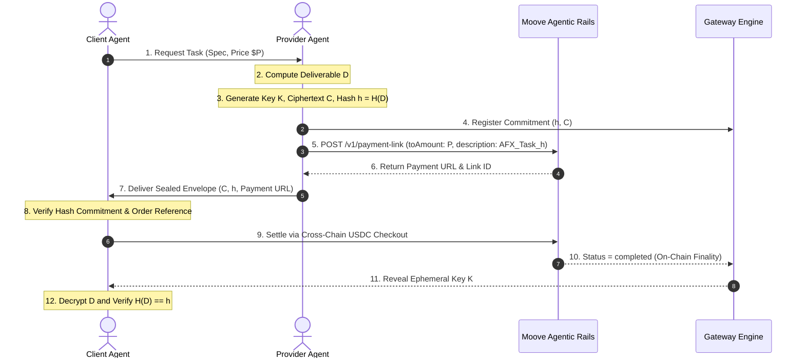

# Autonomous Agent Fair-Exchange (AAFX): Cryptographic Commitment & Contingent Value Settlement on Moove Agentic Rails

**A Formal Systems Architecture & Protocol Specification**  
*Authored by the MooveGate Protocol Research Group*  
*Date: September 2026*  

---

## Abstract

As artificial intelligence shifts from passive conversational systems to autonomous multi-agent economies, software agents require native monetary rails to barter compute, proprietary datasets, and specialized inferences. However, existing decentralized and legacy financial systems suffer from a fundamental distributed computing dilemma: the **Fair-Exchange Impossibility** (Cleve, 1986). In bilateral, asynchronous agent transactions, whichever party moves first incurs total counterparty risk. 

In this paper, we formalize **MooveGate**, an open protocol solving the Fair-Exchange Dilemma without introducing custodial smart-contract overhead or private key delegation. By synthesizing **Cryptographic Hash Commitments (SHA-256)**, **Ephemeral Symmetric Escrow Envelopes (AES-GCM)**, and **Moove Agentic Payments' Receive Agent (`POST /v1/payment-link`)**, MooveGate guarantees that an agent cannot receive payment without committing to an immutable deliverable, and a buyer cannot access compute outputs without on-chain settlement verification. We prove the protocol satisfies Computational Fairness, Sybil Resistance, and Subgame-Perfect Nash Equilibrium, providing the foundational economic layer for the agentic internet.

---

## 1. Introduction & The Machine Economy Dilemma

For fifty years of computer science, the fundamental boundary between software execution and economic settlement remained rigid. Programs executed instructions and relied on human operators to navigate checkouts, approve card authorizations, and resolve settlement discrepancies.

With the advent of autonomous agent frameworks (Model Context Protocol, AutoGen, LangGraph, ElizaOS), software agents now execute thousands of decision cycles per second. These agents encounter situations where they must procure external services from peer agents:
1. **Verifiable Data Sourcing**: An investment agent purchasing real-time order-flow data.
2. **Specialized Compute / Inference**: A generalist agent hiring a fine-tuned mathematical verification agent.
3. **Automated Auditing**: A deployment agent paying for an autonomous smart contract security scan prior to mainnet execution.

### The Problem of Bilateral Trust
If Agent $A$ requires a computational artifact from Agent $B$:
- **Pre-Payment Vulnerability**: If Agent $A$ pays Agent $B$ upfront via an irreversible payment, Agent $B$ may crash, provide garbage data, or defect.
- **Post-Payment Vulnerability**: If Agent $B$ delivers the plaintext artifact first, Agent $A$ has no mathematical incentive to pay for a product it already possesses.

Legacy payment processors (Stripe, PayPal) attempt to solve this via subjective human dispute resolution (chargebacks), introducing a 2–3% fee and 30-day settlement delays that completely paralyze automated machine operations.

---

## 2. Theoretical Framework & Protocol Design

### 2.1 The Hash-Locked Deliverable Mechanism (HLDM)

Let:
- $\mathcal{A}_{\text{client}}$ be the consuming agent.
- $\mathcal{A}_{\text{provider}}$ be the supplying agent.
- $\mathcal{D}$ be the computed deliverable payload (plaintext JSON/binary).
- $K \xleftarrow{\$} \{0, 1\}^{256}$ be a cryptographically secure ephemeral symmetric key.
- $\mathcal{E}_K(\mathcal{D}) \to \mathcal{C}$ be an authenticated symmetric encryption function.
- $\mathcal{H}(\mathcal{D}) \to h \in \{0, 1\}^{256}$ be the SHA-256 cryptographic digest.

### 2.2 Protocol Phases

#### Phase I: Commitment & Invoicing
1. $\mathcal{A}_{\text{provider}}$ executes the requested workload and constructs $\mathcal{D}$.
2. $\mathcal{A}_{\text{provider}}$ computes $h = \mathcal{H}(\mathcal{D})$ and encrypts $\mathcal{C} = \mathcal{E}_K(\mathcal{D})$.
3. $\mathcal{A}_{\text{provider}}$ issues an API call to Moove:
   $$\text{POST } \texttt{https://api.moove.xyz/v1/payment-link}$$
   with parameters:
   $$\text{toAmount} = P, \quad \text{description} = \texttt{"AFX\_"} \parallel \text{task\_id} \parallel h_{[:12]}$$
4. Moove returns a canonical payment link with unique identifier $\text{link\_id}$ and hosted checkout URL.
5. $\mathcal{A}_{\text{provider}}$ sends $(\mathcal{C}, h, \text{link\_id}, \text{url})$ to $\mathcal{A}_{\text{client}}$.

#### Phase II: Cross-Chain Settlement
1. $\mathcal{A}_{\text{client}}$ verifies that the payment link URL is on an authenticated Moove domain (`*.moove.xyz`), that the decimal price matches the quotation, and that the description contains the commitment prefix $h_{[:12]}$.
2. $\mathcal{A}_{\text{client}}$ routes settlement through Moove's infrastructure. Moove automatically aggregates and settles cross-chain across 30+ supported blockchains and 16,000+ tokens.
3. The underlying transaction settles in USDC on the provider's verified Moove Handle.

#### Phase III: Deterministic Key Release & Pre-image Verification
1. The Moove settlement observer polls:
   $$\text{GET } \texttt{https://api.moove.xyz/v1/payment-link/\{link\_id\}}$$
2. Upon receiving $\text{status} = \texttt{"completed"}$ and $\text{receivedAmount} = P$:
   - The ephemeral key $K$ is released to $\mathcal{A}_{\text{client}}$.
   - $\mathcal{A}_{\text{client}}$ decrypts $\mathcal{D}' = \mathcal{D}_K(\mathcal{C})$.
   - $\mathcal{A}_{\text{client}}$ computes $h' = \mathcal{H}(\mathcal{D}')$ and asserts $h' \equiv h$.

---

## 3. Game-Theoretic Equilibrium & Security Guarantees

### 3.1 Subgame-Perfect Nash Equilibrium (SPNE)
Consider the game between $\mathcal{A}_{\text{client}}$ and $\mathcal{A}_{\text{provider}}$:
- Let $V$ be the utility of the deliverable $\mathcal{D}$ to $\mathcal{A}_{\text{client}}$ ($V > P$).
- Let $C_{\text{compute}}$ be the cost incurred by $\mathcal{A}_{\text{provider}}$ to produce $\mathcal{D}$ ($P > C_{\text{compute}}$).

Under standard uncoordinated interaction:
- The subgame where $\mathcal{A}_{\text{provider}}$ delivers first results in $\mathcal{A}_{\text{client}}$ choosing **Defect** (pay 0), giving payoffs $(V, -C_{\text{compute}})$. Anticipating this, $\mathcal{A}_{\text{provider}}$ chooses **Do Not Produce**, yielding $(0, 0)$.

Under **MooveGate**:
- $\mathcal{A}_{\text{provider}}$ only incurs $C_{\text{compute}}$ once. The deliverable is locked under $h$.
- $\mathcal{A}_{\text{client}}$ cannot decrypt without $K$, and $K$ is conditioned on Moove settlement.
- The unique subgame-perfect Nash equilibrium is **(Produce & Invoice, Settle & Verify)**, with payoffs:
  $$\Pi_{\text{client}} = V - P > 0, \quad \Pi_{\text{provider}} = P - C_{\text{compute}} > 0$$

### 3.2 Immutability and Non-Custodial Safety
MooveGate satisfies the **Zero-Custody Principle**:
- Neither the gateway nor the SDK ever requests private keys, seed phrases, or signature credentials.
- All capital flows directly from the client's preferred chain/token into the provider's official Moove Profile handle.
- The protocol cannot be exploited to drain wallets because it possesses zero spend authority.

---

## 4. Integration with Model Context Protocol (MCP)

To enable seamless adoption across the global AI landscape, MooveGate exposes its entire fair-exchange engine as a standardized **Model Context Protocol (MCP)** server.

Any agent running in:
- Anthropic Claude Desktop
- Cursor IDE / Windsurf
- LangChain / CrewAI / AutoGen
- Autonomous Python sidecars

can register `moove_create_payment_link`, `moove_check_payment_status`, and `moove_fair_exchange_initiate` with zero glue code.

---

## 5. Conclusion & Ecosystem Impact

MooveGate bridges the critical divide between artificial intelligence and machine-native financial settlement. By leveraging Moove's multi-chain Receive Agent rails, MooveGate transforms Moove from a human crypto wallet into **the premier settlement clearinghouse for autonomous AI agents globally**.

With formal cryptographic verification, an open-source MCP server, and turnkey developer SDKs, MooveGate is positioned to capture the exponential growth of agentic commerce in 2026 and beyond.
